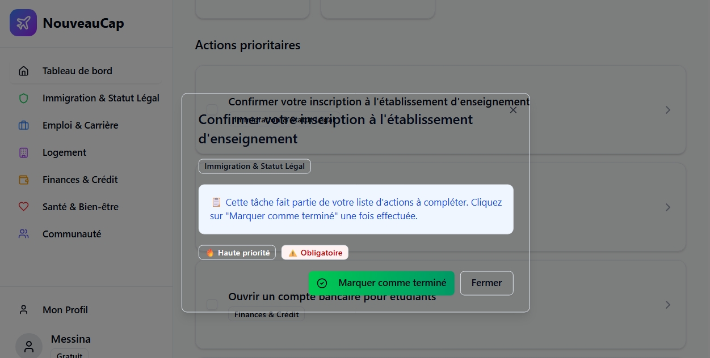

# 🍁 NouveauCap

**Le GPS de votre immigration au Canada.** Plateforme SaaS bilingue (FR/EN) qui guide les nouveaux arrivants pas à pas : parcours personnalisé selon votre statut et votre province, échéances à ne pas manquer, outils gratuits et accompagnement premium.



## Le problème

Immigrer au Canada, c'est des dizaines de démarches dans le bon ordre, avec des règles différentes selon la province (RAMQ vs OHIP), le statut (RP, permis de travail, étudiant, PVT) et des délais stricts. L'information existe, mais elle est éparpillée, en anglais, et rien ne vous dit **quoi faire, quand, pour votre cas précis**.

## La solution

Un parcours guidé personnalisé, construit sur un corpus vérifié couvrant **10 provinces × 4 statuts d'immigration**, avec sources gouvernementales officielles :

- ✅ **Checklist personnalisée** — tâches générées selon votre statut, votre province et votre date d'arrivée, avec documents requis, délais et coûts
- 🧮 **Simulateur CRS** — estimez votre score Entrée express
- 📝 **Optimisation CV IA** — adaptez votre CV aux normes canadiennes (ATS, format, mots-clés)
- 🎓 **Quiz citoyenneté** — préparez l'examen
- 🏦 **Comparateur banques** — offres nouveaux arrivants
- 🏠 **Logement, santé, finances** — guides par province
- 🔔 **Alertes d'échéances** — expiration de permis, délais d'inscription santé

## Offres

| Plan | Prix | Contenu |
|---|---|---|
| Gratuit | 0 $ | Simulateur CRS, quiz citoyenneté, checklist de base, 3 alertes/mois |
| Premium | 19,99 $/mois | CV IA illimité, alertes illimitées, rappels permis, support prioritaire |
| Famille | 39,99 $/mois | Premium pour 4 membres, tableau de bord familial |

## Stack technique

- **Next.js 16** (App Router) + TypeScript + Tailwind CSS 4 + shadcn/ui
- **Prisma** — SQLite en dev, PostgreSQL/Supabase en prod ([schéma](prisma/schema.postgresql.prisma))
- **Auth JWT** (jose) — cookies httpOnly, sessions 7 jours
- **Stripe** — abonnements + webhooks (checkout, update, cancel, payment_failed)
- **i18n** français/anglais

## Démarrage

```bash
bun install
cp .env.example .env       # remplir les variables
bunx prisma db push
bunx prisma db seed
bun run dev                # http://localhost:3000
```

### Variables d'environnement

Voir [.env.example](.env.example). Obligatoires : `DATABASE_URL`, `JWT_SECRET` (min 32 caractères). Optionnelles : clés Stripe, `ADMIN_EMAILS`.

## Déploiement

Guide complet : [DEPLOYMENT.md](DEPLOYMENT.md) (Vercel + Supabase recommandé, Railway ou VPS+Caddy en alternative).

## Structure

```
src/
├── app/
│   ├── api/          # Routes API (auth, onboarding, IA, abonnements, admin)
│   └── page.tsx      # Application (refactor en modules en cours)
├── components/       # UI (shadcn/ui + composants métier)
├── i18n/             # Traductions FR/EN
└── lib/              # Auth JWT, Stripe, Prisma, design system
prisma/               # Schémas SQLite (dev) et PostgreSQL (prod) + seed
nouveau-cap-mobile/   # App Expo (préliminaire)
```

## Avertissement

NouveauCap fournit de l'**information et des outils d'organisation**, pas des conseils en immigration au sens de la loi canadienne. Pour un avis sur votre dossier, consultez un consultant réglementé (CRIC) ou un avocat. Les informations sont fournies avec leurs sources officielles ; vérifiez toujours auprès d'IRCC et des organismes provinciaux.

---

© NouveauCap. Tous droits réservés.
